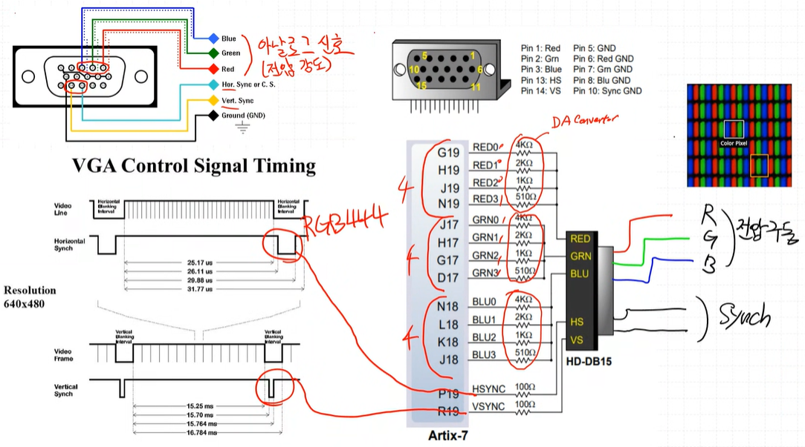

# VGA

## 개요

### VGA horizontal synchronization

### VGA 640 x 480 기준

### VGA Control Signal Timming

- video line (1 frame)이 모여서 video frame형성 
- porch(front & back)와 sync 시간까지 고려 
- 1 frame 형성에 porch+sync 포함 31.77 us 걸리고, 수직이므로 x 480 하여 16.784 ms

### VGA signal map

### vga 설계도
