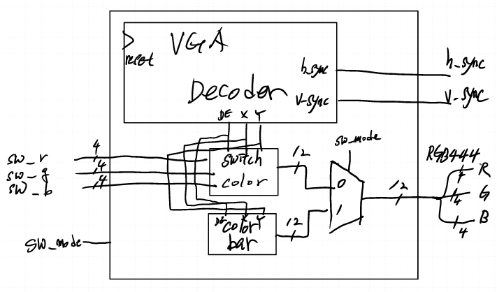
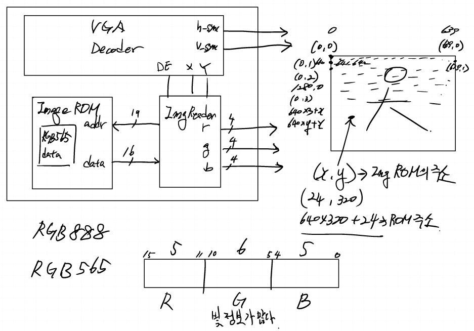
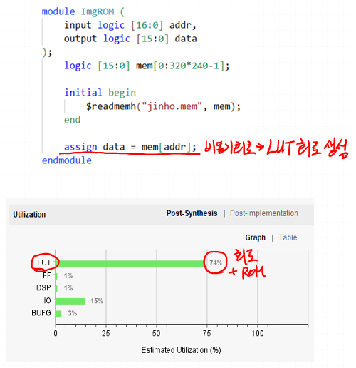
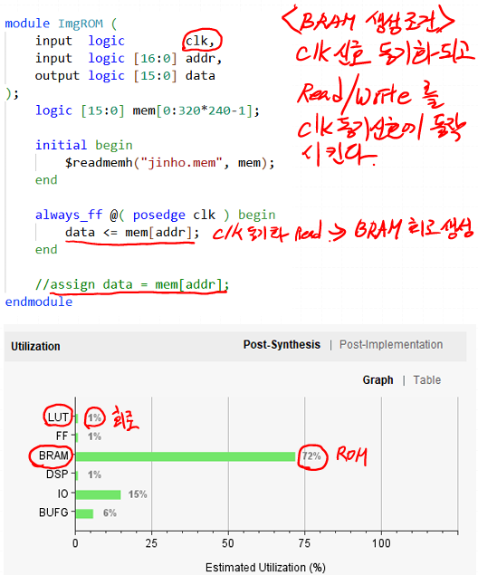
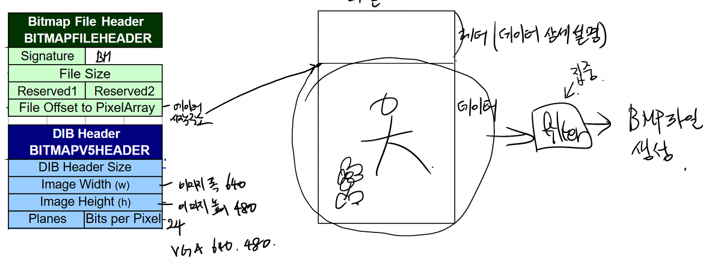
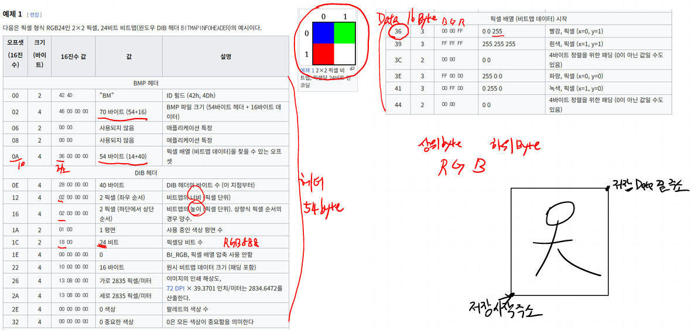

# VGA

## 모듈 설계
**스위치로 RGB 선택 + color bar 이미지 띄우기 선택 diagram**

--------------

**이미지 리더 모듈이 ROM에 저장된 데이터를 가져와서 사용**

---------------

**비동기 회로는 LUT 회로를 생성하고, 동기화 회로를 통해 read & write 하면 BRAM을 사용**

## Gray Filter
**Y = (R + G + B)/3**
- Y = 0.3R + 0.6G + 0.1B
- scale 256 기준 : Y = 77R + 154G + 25B

## BMP 파일 처리

- BMP 파일 생성을 통해 비트스트림까지 하지 않고, 간편하게 시뮬레이션으로 결과 확인
