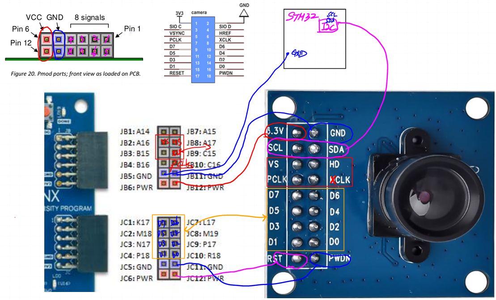

# VGA

## VGA 영상 처리를 위한 OV7670 & STM32 NUCLEO & BASYS3 연결

- 점퍼선 상태가 안좋아서 연결 시 상호 간섭 최소화 하도록 주의

## VGA Camera 동작을 위한 FPGA, STM32Nucleo, Camera 연결

- camera가 fpga에게 주는 clk이 pclk, fpga가 camera에게 주는 clk이 xclk

## VGA Camera data timing

- HREF가 high 이고 PCLK이 rising edge 될 때 첫번째 유효 data 8bit (First Byte)
-----

- RGB 565는 16bit 이므로 8bit씩 두번받아서 해당 data가 pixel data가 된다. 포맷은 그림 참조
-----

- VSYNC가 high = 1 frame이 끝났다 -> VSYNC가 low인동안 HREF를 받겠다

## FPGA, OV7670 연결 설계

- diagram 왼쪽은 Camera Domain, 오른쪽은 VGA Display Domain
- 두 도메인이 사용하는 clk이 다르므로 VRAM FrameBuffer에서 CDC 컨트롤 필요
- 카메라는 30frame 이고, 이미지 처리는 60frame이다
--------------

- gray filter 추가하여 스위치로 관리하는 모델
--------------

## STM32 Nucleo board
- STM32CubeIDE 사용 숙지

**화면으로 카메라 영상 촬영 데이터 출력완료**

